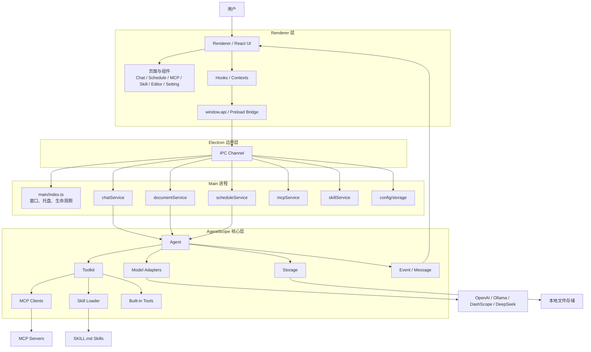

# 代码分析报告

## 1. 仓库定位

该仓库是一个 TypeScript monorepo，包含两大主体：

- `packages/agentscope`：AgentScope 核心框架，负责 Agent、Model、Tool、MCP、Storage、Event 等基础能力。
- `apps/desktop`：基于 Electron + React 的桌面应用 Friday，负责聊天 UI、文档编辑、技能管理、MCP 接入、定时任务与系统集成。

## 2. 主要特性与代码量

> 统计口径：按功能域聚合 `.ts/.tsx/.js/.mjs/.json/.css/.d.ts` 文件行数；属于近似工程规模统计，适合做架构判断，不等同于“纯业务有效代码行”。

| 特性                          | 说明                                                                | 文件数 | 代码量（行） |
| ----------------------------- | ------------------------------------------------------------------- | -----: | -----------: |
| 核心 Agent Runtime            | Agent 推理循环、模型适配、消息抽象、事件流、上下文存储与压缩记忆    |     27 |         6317 |
| Tool / MCP / Skill 扩展体系   | 内置工具、MCP 客户端、技能导入/扫描/启用、桌面端 MCP/Skill 管理界面 |     39 |         5973 |
| 桌面聊天体验                  | 会话管理、消息流式渲染、执行反馈、Friday 对话主流程                 |     12 |         1889 |
| 定时调度自动化                | 定时任务 CRUD、执行编排、执行日志、日历/列表视图                    |     15 |         2656 |
| 文档编辑工作流                | 文档管理、编辑器页面、文档对话、内容保存与工具化访问                |     10 |         1621 |
| 配置 / 启动 / Onboarding 外壳 | Electron 主进程、Preload IPC、设置页、布局、首次引导与 Ollama 检测  |     26 |         2325 |

## 3. 主要特性解读

### 3.1 核心 Agent Runtime

这是仓库最核心的能力层，承担“Agent 如何思考和执行”的职责：

- `Agent` 维护上下文、系统提示词、迭代轮次、工具确认状态和压缩摘要。
- `replyStream()` / `reply()` 统一了同步响应与事件流式输出。
- `Toolkit` 负责注册普通工具、MCP 工具与技能工具，并统一参数校验与调用返回。
- `Model` 目录封装 OpenAI、Ollama、DashScope、DeepSeek 等模型接入。
- `Storage` 负责会话状态持久化与上下文离线存储。
- `Event` / `Message` 让前端能够以事件驱动方式消费推理、工具调用和文本增量。

### 3.2 Tool / MCP / Skill 扩展体系

这是仓库的第二条主线，体现“Agent 能接什么外部能力”：

- `Toolkit` 内置普通工具与技能读取工具。
- `packages/agentscope/src/mcp` 支持 HTTP 与 stdio 两种 MCP 传输。
- 桌面端主进程提供 MCP 与 Skill 的 IPC handler / service。
- 桌面端渲染层提供 MCP 页面、Skill 页面、导入弹窗与状态管理 hook。
- `skillService` 会扫描监听目录中的 `SKILL.md`，解析 front matter 并持久化启用状态。

### 3.3 桌面聊天体验

这是 Friday 最直接面向用户的主交互：

- 主进程 `chatService` 负责会话列表、消息持久化、运行中状态和调用 Agent。
- `runAgent` 将 Agent 事件不断推送到 `agent:event:{sessionId}` 通道。
- 渲染层通过 `use-chat`、`use-messages`、`use-execution-messages` 订阅事件并驱动气泡 UI。
- 这一层把 AgentScope 的流式事件模型转成 Electron 应用可用的实时对话体验。

### 3.4 定时调度自动化

这是桌面应用区别于普通聊天壳的重要能力：

- 主进程启动时初始化 scheduler。
- 调度服务负责 schedule 的创建、更新、删除、查询与执行记录读取。
- 渲染层提供日历视图、列表视图、执行日志与详情抽屉。
- 该能力实质上把“Agent 一次性执行”扩展为“Agent 定时自动执行”。

### 3.5 文档编辑工作流

这是“对话 + 文档”一体化能力：

- `documentService` 提供文档 CRUD、正文读取/保存、文档对话消息与 Agent 执行入口。
- 编辑器页面下含页面主体、侧边栏和前端工具桥接。
- `shared/tools/document.ts` 表明文档也被抽象成 Agent 可访问工具。
- 说明该系统不是单纯聊天软件，而是支持围绕工作文档进行协作。

### 3.6 配置 / 启动 / Onboarding 外壳

这是桌面产品稳定运行所需的基础设施层：

- `main/index.ts` 负责 Electron 生命周期、托盘、窗口、各类 IPC 注册。
- `preload/index.ts` 暴露 `config/chat/editor/schedule/mcp/skill/dialog` 等桥接 API。
- React 根组件 `App.tsx` 处理路由、onboarding、tour 与全局 provider。
- 设置页与 Ollama 检测流程说明产品强调本地模型与可配置化接入。

## 4. 逻辑架构图

## 5. 架构结论

### 5.1 分层结构清晰

整体是典型的 4 层结构：

1. **Renderer 表现层**：负责交互与展示。
2. **Preload/IPC 边界层**：负责安全桥接。
3. **Main 进程服务层**：负责文件系统、任务调度、Agent 调用与系统资源管理。
4. **AgentScope 核心能力层**：负责推理、工具、模型、消息、事件与扩展协议。

### 5.2 核心重心在两个方向

从代码量看，仓库的真正重心是两部分：

- **Agent 运行时能力**（6317 行）
- **Tool / MCP / Skill 扩展能力**（5973 行）

这说明该项目并不是“先有 UI 再接模型”的普通桌面壳，而是以 **Agent 能力编排与扩展生态** 为中心设计。

### 5.3 Friday 是 AgentScope 的产品化验证壳

桌面应用代码虽然不少，但更多承担的是：

- 把 Agent 核心能力产品化；
- 提供可视化入口（聊天、技能、MCP、调度、编辑器）；
- 将流式事件、安全 IPC、持久化与本地执行整合到一个桌面工作台。

### 5.4 最有辨识度的产品特性

若按“最能体现产品差异化”的角度排序，仓库的特征最强的是：

1. **Agent + Event 流式运行时**
2. **Tool / MCP / Skill 扩展体系**
3. **Schedule 自动调度**
4. **Document/Editor 工作流集成**
5. **Electron 本地桌面化交互壳**
